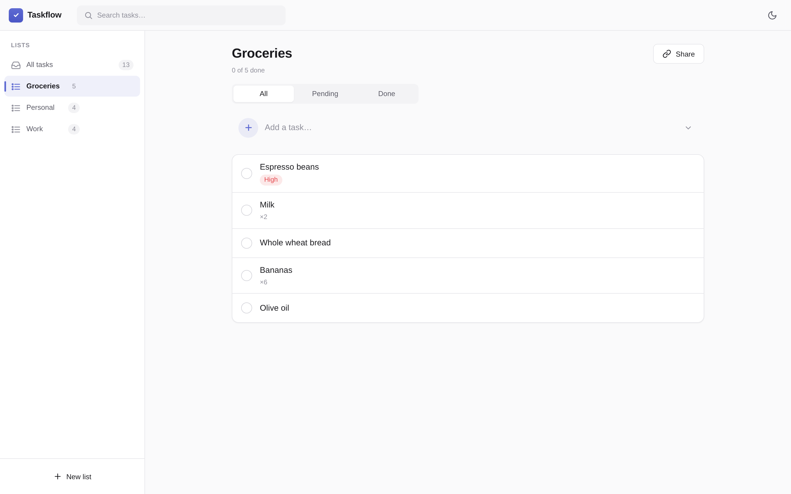
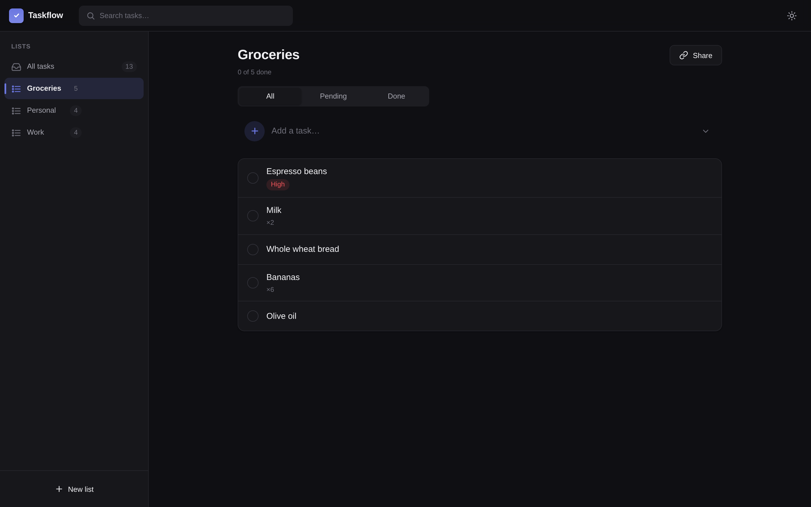
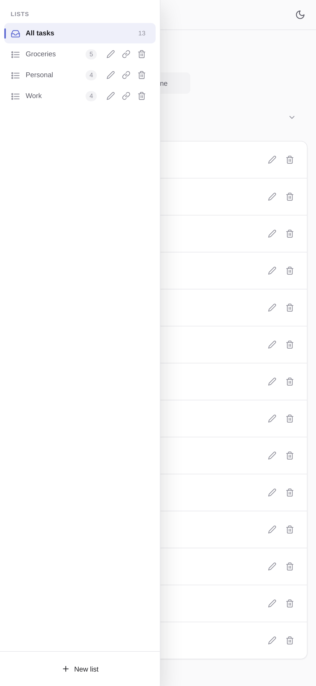

# Taskflow — Centralized Lists for Todo, Shopping & Everything

A centralized, browser-based list app that works for TODOs, shopping lists,
groceries, and any other item tracking — installable as a **PWA**, with a modern
light/dark UI. Built with a zero-dependency philosophy: FastAPI + SQLite +
vanilla JS.

> **✦ Authored entirely by Hermes Agent (Nous Research) running DeepSeek-V4-Flash.**
> Requirements, design, implementation, testing, and this repository were
> produced autonomously by the agent — no human-written application code.

## Screenshots

| Light | Dark | Mobile |
|---|---|---|
|  |  |  |

## Features

- **Multiple lists** — create, rename, delete (Work, Groceries, Personal…)
- **Items** with title, notes, priority (none/low/medium/high), due date, quantity (×2 milk)
- **Recurring tasks** — daily, weekly, monthly, or custom interval; completing one spawns the next occurrence
- **Filters & search** — by list, pending/done status, case-insensitive text search (wildcards escaped)
- **Link sharing** — share any list via an unguessable token, read-only or editable, revocable
- **PWA** — manifest, service worker (offline app shell), installable on phone/desktop
- **Light & dark themes** — system-preference default, manual toggle, persisted
- **Modern UI** — Linear/Notion-class design tokens, mobile-first responsive, toasts, modals, empty states
- **Persistence** — SQLite (WAL), survives restarts

## Tech Stack

| Layer | Choice |
|---|---|
| Backend | Python 3.13, FastAPI, uvicorn |
| Storage | SQLite via stdlib `sqlite3` (no ORM) |
| Frontend | Vanilla HTML/CSS/JS (no frameworks, no build step, no CDN) |
| PWA | Web app manifest + service worker + generated icons |
| Tests | pytest (44 tests: API, validation, recurrence, shares, persistence, PWA) |

## Quickstart

```bash
cd todo-app
uv venv .venv && source .venv/bin/activate   # or: python3 -m venv .venv
pip install -r requirements.txt
uvicorn app.main:app --host 0.0.0.0 --port 8000
```

Open http://localhost:8000

Or use the launcher:

```bash
./run.sh
```

## Tests

```bash
.venv/bin/python -m pytest tests/ -v
```

## API

REST JSON under `/api`:

| Method & path | Purpose |
|---|---|
| `GET/POST /api/lists`, `PATCH/DELETE /api/lists/{id}` | List CRUD |
| `GET/POST /api/items`, `PATCH/DELETE /api/items/{id}` | Item CRUD + toggle done (recurrence spawn) |
| `POST /api/lists/{id}/shares`, `DELETE /api/shares/{token}` | Share links |
| `GET /api/shared/{token}` + item writes | Shared-list access (permission-gated) |
| `GET /api/health` | Liveness/database check |

Errors are always `{"detail": "<string>"}` with proper HTTP status codes.

## Project layout

```
app/          FastAPI application (main, db, schemas, recurrence)
static/       SPA shell, styles, app logic, manifest, service worker, icons
scripts/      Icon generator (Pillow)
tests/        pytest suite (API + PWA)
SPEC.md       Requirements specification
DESIGN.md     Implementation contract
```

## License

MIT
